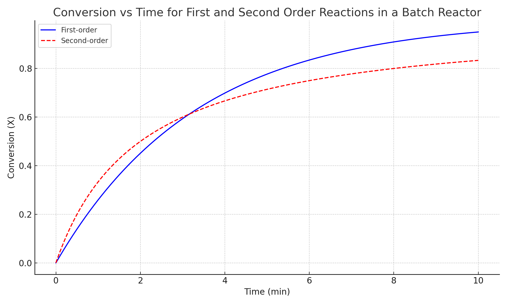

# Batch Reactor Kinetics Simulation

This project simulates and compares the performance of first-order and second-order irreversible reactions in a batch reactor.

##  Theory

### First-Order Reaction
- Rate law: `-r_A = k1 * C_A`
- Integrated form: `C_A = C_A0 * exp(-k1 * t)`

### Second-Order Reaction
- Rate law: `-r_A = k2 * C_A^2`
- Integrated form: `C_A = C_A0 / (1 + k2 * C_A0 * t)`

##  Parameters
- Initial concentration: 1.0 mol/L
- First-order rate constant (k1): 0.3 min⁻¹
- Second-order rate constant (k2): 0.5 L/mol·min
- Time range: 0 to 10 minutes

## Output
The script generates a plot comparing conversion vs. time for both reaction types.

## 🛠 Tools Used
- Python
- NumPy
- Matplotlib
